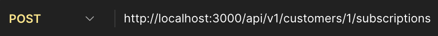
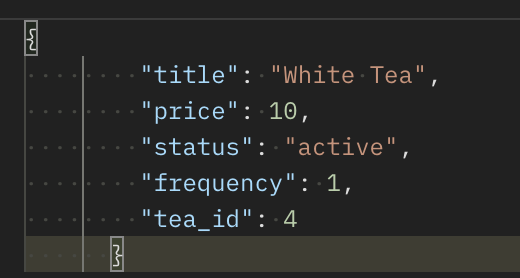
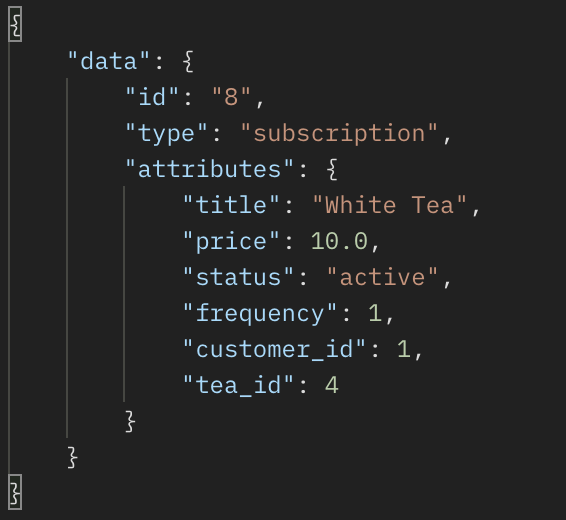
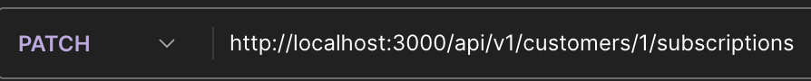
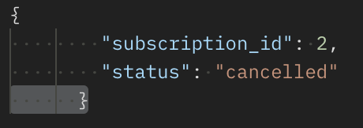
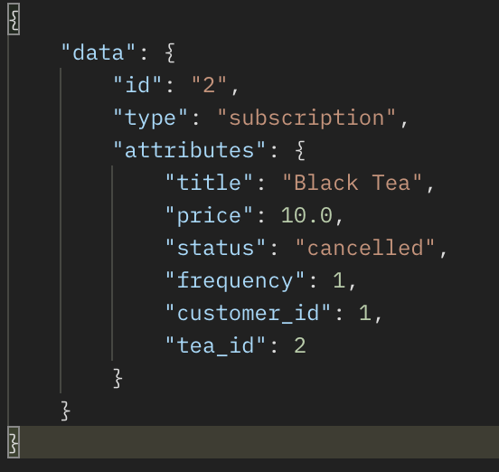
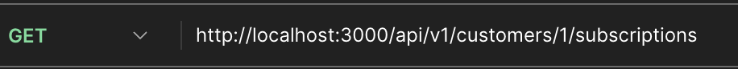
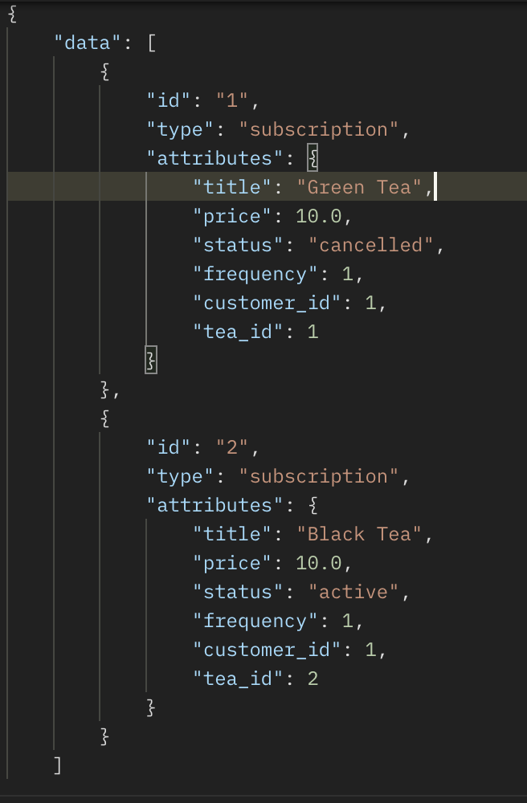
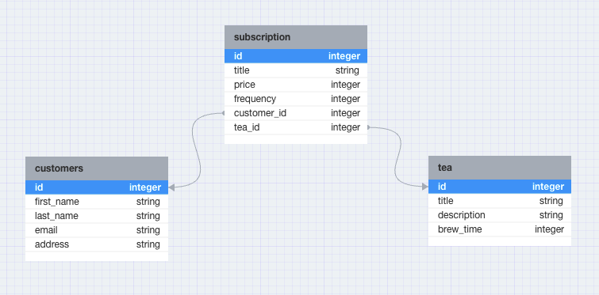

<!-- Improved compatibility of back to top link: See: https://github.com/othneildrew/Best-README-Template/pull/73 -->
<a name="readme-top"></a>
<!--
*** Thanks for checking out the Best-README-Template. If you have a suggestion
*** that would make this better, please fork the repo and create a pull request
*** or simply open an issue with the tag "enhancement".
*** Don't forget to give the project a star!
*** Thanks again! Now go create something AMAZING! :D
-->


<!-- PROJECT SHIELDS -->
<!--
*** I'm using markdown "reference style" links for readability.
*** Reference links are enclosed in brackets [ ] instead of parentheses ( ).
*** See the bottom of this document for the declaration of the reference variables
*** for contributors-url, forks-url, etc. This is an optional, concise syntax you may use.
*** https://www.markdownguide.org/basic-syntax/#reference-style-links
-->


<!-- PROJECT LOGO -->
<br />
<div align="center">

  <h3 align="center">Tea Time</h3>


  <p align="center">
    <br />
    <br />
    <a href="https://github.com/MATrevino/tea_time/issues">Report Bug</a>
    ·
    <a href="https://github.com/MATrevino/tea_time/issues">Request Feature</a>
  </p>
</div>


<!-- TABLE OF CONTENTS -->
<details>
  <summary>Table of Contents</summary>
  <ol>
    <li>
      <a href="#about-the-project">About The Project</a>
      <ul>
        <li><a href="#built-with">Built With</a></li>
      </ul>
    </li>
    <li>
      <a href="#getting-started">Getting Started</a>
      <ul>
        <li><a href="#prerequisites">Prerequisites</a></li>
        <li><a href="#installation">Installation</a></li>
      </ul>
    </li>
    <li><a href="#api-contract">API Contract</a></li>
    <li><a href="#schema">Schema</a></li>
    <li><a href="#issues">Issues</a></li>
    <li><a href="#contributing">Contributing</a></li>
    <li><a href="#license">License</a></li>
    <li><a href="#contributors">Contributors</a></li>
    <li><a href="#acknowledgments">Acknowledgments</a></li>
  </ol>
</details>


<!-- ABOUT THE PROJECT -->
## About The Project


Have you ever ran out of your favorite tea when you were craving it the most? Are you concerned about fairtrade products and want to buy from an ethically sourced company?

Tea Time is a subscription service that allows you to choose your favorite tea and have it delivered to your door every month, or twice a month. This application allows customers to choice their tea and subscription plan, as well as cancel their subscription and see all of their subscriptions, both active and cancelled.

Project Link: <br> 
[GitHub Project Link](https://github.com/MATrevino/tea_time) <br>

<p align="right">(<a href="#readme-top">back to top</a>)</p>


### Built With

This section should list any major frameworks/libraries used to bootstrap your project. Leave any add-ons/plugins for the acknowledgements section. Here are a few examples.

* [![Ruby on Rails][Rails]][Rails-url]
* [![Ruby Gems][Ruby-gems]][Ruby-gems-url]

<p align="right">(<a href="#readme-top">back to top</a>)</p>


<!-- GETTING STARTED -->
## Getting Started

### Prerequisites

* Ruby 3.1.1
* Rails 7.0.4.3

### Installation

1. Clone the repo
    ```sh
    git clone git@github.com:MATrevino/tea_time.git
    ```
1. Install gems
    ```sh
    bundle install
    ```
1. Set up the database
    ```sh
    rails db:{create,migrate,seed}
    ```
1. Run the RSpec Tests
    ```sh
    bundle exec rspec
    ```

<p align="right">(<a href="#readme-top">back to top</a>)</p>


<!-- API CONTRACT -->
## API Contract

Tea Time API Contract

Create subscription

request body:

<br>
response body:


Cancel subscription

request body:

<br>
response body:


3. All subscriptions

request body: none
<br>
response body:


<p align="right">(<a href="#readme-top">back to top</a>)</p>


<!-- SCHEMA -->
## Schema




<p align="right">(<a href="#readme-top">back to top</a>)</p>

<!-- REQUESTSS -->
## Requests
### creates_subscription Query


<p align="right">(<a href="#readme-top">back to top</a>)</p>

<!-- POSTMAN -->
## Postman Queries

#add if time allows

<p align="right">(<a href="#readme-top">back to top</a>)</p>


<!-- ISSUES -->
## Issues

See the [open issues](https://github.com/MATrevino/tea_time/issues) for a full list of proposed features and known issues).


<p align="right">(<a href="#readme-top">back to top</a>)</p>


<!-- CONTRIBUTING -->
## Contributing

Contributions are what make the open source community such an amazing place to learn, inspire, and create. Any contributions you make are **greatly appreciated**.

If you have a suggestion that would make this better, please fork the repo and create a pull request. You can also simply open an issue with the tag "enhancement".
Don't forget to give the project a star! Thanks again!

1. Fork the Project
2. Create your Feature Branch (`git checkout -b feature/AmazingFeature`)
3. Commit your Changes (`git commit -m 'Add some AmazingFeature'`)
4. Push to the Branch (`git push origin feature/AmazingFeature`)
5. Open a Pull Request

<p align="right">(<a href="#readme-top">back to top</a>)</p>


<!-- LICENSE -->
## License

Distributed under the MIT License. See `LICENSE.txt` for more information.

<p align="right">(<a href="#readme-top">back to top</a>)</p>


<!-- CONTRIBUTORS -->

## Contributors

 

| Meredith Trevino | <br>
| Collaborator | <br>
[![GitHub][github-shield]][github-meredith]  <br>
[![LinkedIn][linkedin-shield]][linkedin-meredith]


<p align="right">(<a href="#readme-top">back to top</a>)</p>


<!-- ACKNOWLEDGMENTS -->
## Acknowledgments

These are some of the resources we used for the project and the README.

#### ReadMe Resources
* [README Template](https://github.com/othneildrew/Best-README-Template)

* [Img Shields](https://shields.io)

* [GitHub Badges](https://home.aveek.io/GitHub-Profile-Badges/)


<p align="right">(<a href="#readme-top">back to top</a>)</p>


<!-- MARKDOWN LINKS & IMAGES -->
<!-- https://www.markdownguide.org/basic-syntax/#reference-style-links -->


[linkedin-shield]: https://img.shields.io/badge/-LinkedIn-black.svg?style=for-the-badge&logo=linkedin&colorB=555

[linkedin-meredith]: https://www.linkedin.com/in/meredith-trevino/


[product-screenshot]: images/screenshot.png

[github-shield]: https://img.shields.io/badge/GitHub-181717.svg?style=for-the-badge&logo=GitHub&logoColor=white

[github-meredith]: https://github.com/MAtrevino


[Rails]: https://img.shields.io/badge/-Ruby%20on%20Rails-CC0000?logo=ruby-on-rails&logoColor=white&style=for-the-badge
[Rails-url]: https://rubyonrails.org 

[Ruby-gems]: https://img.shields.io/badge/RubyGems-E9573F.svg?style=for-the-badge&logo=RubyGems&logoColor=white
[Ruby-gems-url]: https://rubygems.org/

